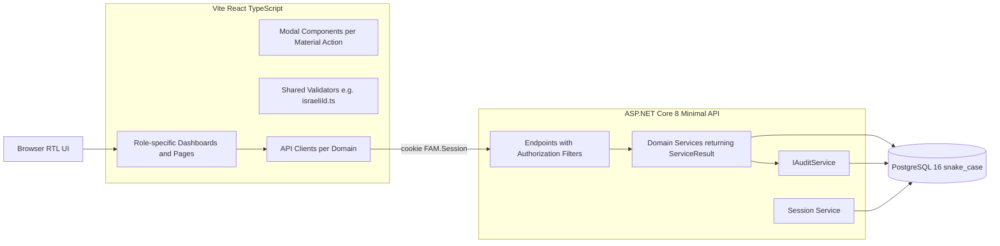
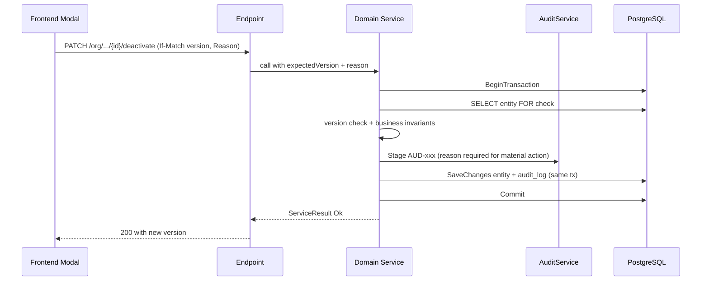

# Family Assistance Management — Canonical Architecture

**Document status:** Canonical living architecture document.
**Last updated baseline:** Step 4 approved (tag `step-4-approved`, commit `54b786e`).
**Scope:** This document supersedes scattered per-step architecture notes for everything that is currently in scope. Per-step compliance reports under `docs/step-0N-*` remain as historical evidence.

---

## 1. Project Overview

### 1.1 Purpose

A multi-tenant, Hebrew RTL platform that lets non-profit organizations manage the full lifecycle of family assistance: organization onboarding, internal user administration, family registration, assistance-type catalog, and (in future phases) requests, committee decisions, suppliers, and distributions.

### 1.2 Technology stack

| Layer    | Technology |
| -------- | ---------- |
| Backend  | ASP.NET Core 8 minimal API, C# 12 |
| Frontend | React 18 + TypeScript, Vite |
| Database | PostgreSQL 16 with EF Core 8 (snake_case mapping) |
| Auth     | Server-side cookie session (`FAM.Session`), `PasswordHasher<User>` |
| Deploy   | Docker Compose (postgres + api + web) |
| Locale   | Hebrew RTL across all screens |

### 1.3 High-level component diagram

### 1.4 Repository layout (essentials)

| Path | Purpose |
| ---- | ------- |
| `backend/FamilyAssistance.Api/` | Minimal API project |
| `backend/FamilyAssistance.Api/Migrations/` | EF Core migrations (applied on startup) |
| `frontend/src/` | React + TypeScript frontend |
| `docs/` | Architecture and compliance documents |
| `scripts/` | PowerShell end-to-end verification scripts (`verify-step0N.ps1`) |
| `.cursor/plans/` | Per-step technical design plans |
| `docker-compose.yml` | Local-dev environment |

---

## 2. Approved Steps (1–4)

| Step | Title | Primary actor(s) | Scope summary | Audit codes added | Git tag |
| ---- | ----- | ---------------- | ------------- | ----------------- | ------- |
| 1 | Foundation | SuperAdmin (seeded) | Auth, server-side sessions, security audit, 7-table schema | SEC-001..005 | — (initial commit) |
| 2 | SuperAdmin organization management | SuperAdmin | Create org, suspend org with reason, bootstrap first OrgAdmin | AUD-001 (org create), AUD-002 (org suspend), AUD-003 (org admin bootstrap) | `step-2-approved` |
| 3 | OrgAdmin user management + Activity Log | OrganizationAdministrator | Create / edit / disable users (Coordinator, Manager, Finance only); read-only Activity Log; user creation confirmation screen | AUD-004 (user create), AUD-005 (user update), AUD-006 (user disable) | `step-3-approved` |
| 4 | Families + Assistance Types | Coordinator (Families), Finance (Assistance Types); read-only Manager and OrgAdmin | System-generated `F-NNNNNN` per org, optional Israeli ID with checksum, orphan prevention, ILS-fixed currency, type-code uppercase | AUD-007 (family create), AUD-008 (family update), AUD-009 (family deactivate), AUD-010 (type create), AUD-011 (type update), AUD-012 (type deactivate) | `step-4-approved` |

Step 5 has not been planned or approved at the time of this document.

---

## 3. Current Architecture Baseline

### 3.1 Database schema (7 tables + permissions tables pending)

| Table                    | Versioned | Notes |
| ------------------------ | :-------: | ----- |
| `organizations`          | Yes       | Per-org `family_code_counter int` for atomic `F-NNNNNN` generation |
| `users`                  | Yes       | Role ∈ {SuperAdmin, OrganizationAdministrator, Coordinator, Manager, Finance}; status ∈ {active, disabled} |
| `user_sessions`          | No        | Server-side opaque session tokens (`FAM.Session` cookie); revoked on user disable / logout |
| `audit_logs`             | No        | Business events AUD-001..012 (append-only) |
| `security_audit_logs`    | No        | Security events SEC-001..005 (append-only) |
| `families`               | Yes       | Step 4; **embedded bank fields** (§14 design); unique `(organization_id, family_code)` |
| `assistance_types`       | Yes       | Step 4; unique `(organization_id, type_code)`; currency fixed to `ILS` |

**Retired (approved design, pre-implementation):** `bank_accounts`, `bank_account_history` — bank details are **embedded** on `families` and `suppliers` (no separate bank entity, no OwnerType/OwnerId). See [permissions_system_design_add4b9ad.plan.md](../.cursor/plans/permissions_system_design_add4b9ad.plan.md) §14–§15.

**Pending:** `suppliers` (with embedded bank), permissions tables (`organization_roles`, `organization_role_grants`).

All editable entities use `version int` for optimistic concurrency.
All tables use `snake_case` column naming via `AppDbContext.ApplySnakeCaseNames`.

### 3.2 API surface (today)

| Group | Endpoint | Method | Authorization filter |
| ----- | -------- | :----: | -------------------- |
| Health | `/api/v1/health` | GET | none |
| Auth   | `/api/v1/auth/login` | POST | none |
| Auth   | `/api/v1/auth/logout` | POST | session |
| Auth   | `/api/v1/auth/me` | GET | session |
| SuperAdmin orgs | `/api/v1/admin/organizations` | GET, POST | `RequireSuperAdmin` |
| SuperAdmin orgs | `/api/v1/admin/organizations/{id}/suspend` | PATCH | `RequireSuperAdmin` |
| SuperAdmin orgs | `/api/v1/admin/organizations/{id}/admin` | POST | `RequireSuperAdmin` |
| OrgAdmin users  | `/api/v1/org/users` | GET, POST | `RequireOrgAdmin` |
| OrgAdmin users  | `/api/v1/org/users/{id}` | PATCH | `RequireOrgAdmin` |
| OrgAdmin users  | `/api/v1/org/users/{id}/disable` | PATCH | `RequireOrgAdmin` |
| OrgAdmin log    | `/api/v1/org/activity-log` | GET | `RequireOrgAdmin` |
| Families        | `/api/v1/org/families` | GET | `RequireFamilyViewer` (Coordinator/Manager/OrgAdmin) |
| Families        | `/api/v1/org/families` | POST | `RequireCoordinator` |
| Families        | `/api/v1/org/families/{id}` | GET | `RequireFamilyViewer` |
| Families        | `/api/v1/org/families/{id}` | PATCH | `RequireCoordinator` |
| Families        | `/api/v1/org/families/{id}/deactivate` | PATCH | `RequireCoordinator` |
| Assistance types| `/api/v1/org/assistance-types` | GET | `RequireTypeViewer` (Finance/Manager/OrgAdmin) |
| Assistance types| `/api/v1/org/assistance-types` | POST | `RequireFinance` |
| Assistance types| `/api/v1/org/assistance-types/{id}` | GET | `RequireTypeViewer` |
| Assistance types| `/api/v1/org/assistance-types/{id}` | PATCH | `RequireFinance` |
| Assistance types| `/api/v1/org/assistance-types/{id}/deactivate` | PATCH | `RequireFinance` |

### 3.3 Cross-cutting building blocks

- **`ServiceResult<T>`** — uniform service return shape (`StatusCode`, `Code`, `Error`, `Details`, `Value`).
- **`ApiError`** — standardized error payload with Hebrew messages.
- **`IAuditService`** — `Stage` / `LogAsync`; staged entries flush in the same `SaveChangesAsync` as the business change. Material actions (`organization_suspend`, `user_disable`, `family_deactivate`, `assistance_type_deactivate`, etc.) enforce a `Reason` of length ≥ 3 inside `AuditService.CreateLog`; missing reason throws `ArgumentException`, which rolls back the transaction.
- **Optimistic concurrency** — every PATCH endpoint reads `If-Match` header into an expected `version`; mismatch returns `409 VERSION_CONFLICT`.
- **Session management** — opaque server-side session tokens, hashed at rest; revoked atomically with `user_disable`.
- **Organization isolation** — `organizationId` is taken exclusively from `httpContext.GetCurrentUser()`, never from request body or query string. Every service method filters by it. DB composite unique indexes are `(organization_id, …)`.
- **Frontend conventions** — state-driven routing in `App.tsx`, dedicated modal per material action, Hebrew RTL throughout, shared validators (e.g. `frontend/src/validation/israeliId.ts`), no external UI component library.

### 3.4 Concurrency and material-action flow

### 3.5 Identifier and code generation

- **Organization code** — uppercase A–Z, 0–9, hyphen; validated server-side; unique across the system.
- **Family code** — `F-NNNNNN`, system-generated only; never accepted from the client. Generated atomically per organization via `UPDATE organizations SET family_code_counter = family_code_counter + 1 WHERE id = … RETURNING family_code_counter` inside the same transaction as the family insert. Counter is per-organization (each org starts at `F-000001`).
- **Assistance type code** — uppercase A–Z, 0–9, hyphen; length 2–50; normalized to upper before persistence; unique within the organization.

### 3.6 Validation

- **Israeli ID (`headIdNumber`)** — optional. If provided, must be exactly 9 digits and pass the Luhn-style modulus-10 checksum. Implemented identically in `backend/FamilyAssistance.Api/Validation/IsraeliIdValidator.cs` and `frontend/src/validation/israeliId.ts`. Error message: `מספר תעודת זהות אינו תקין`.
- **Reason for material action** — required, length 3–500.
- **Field length and range limits** — declared centrally per entity in the domain service's create/update validator.

---

## 4. Roles and Permissions

### 4.1 Roles

| Role | Scope | Created by |
| ---- | ----- | ---------- |
| `SuperAdmin` | System-wide. No organization context. Operates only on `/api/v1/admin/*`. | Seeded once from environment variable (`SUPERADMIN_INITIAL_PASSWORD`). |
| `OrganizationAdministrator` | Single organization. | Bootstrapped by `SuperAdmin` per organization (one initial admin in Step 2; additional admins out of current scope). |
| `Coordinator` | Single organization. Owns their assigned families. | `OrganizationAdministrator`. |
| `Manager` | Single organization. Read-only across families and assistance types. | `OrganizationAdministrator`. |
| `Finance` | Single organization. Owns assistance types catalog. | `OrganizationAdministrator`. |

### 4.2 Permission matrix (currently implemented)

Legend: **F** = full (view + create + edit + deactivate within scope) · **R** = read-only · **—** = no access.

| Resource ↓ / Role → | SuperAdmin | OrgAdmin | Coordinator | Manager | Finance |
| ------------------- | :--------: | :------: | :---------: | :-----: | :-----: |
| Organizations (system-wide) | F (create, suspend, bootstrap admin) | — | — | — | — |
| Org users (Coordinator/Manager/Finance) | — | F | — | — | — |
| Org users (OrganizationAdministrator) | only initial bootstrap | view self only | — | — | — |
| Activity Log (own org) | — | R | — | — | — |
| Families (own org) | — | R | F **on own families only** | R | — |
| Assistance Types (own org) | — | R | — | R | F |

Login itself fails for any user whose organization is `suspended` (`AuthEndpoints.cs` rejects with `ACCOUNT_INACTIVE` / `ORG_SUSPENDED`), regardless of the user's own status.

### 4.3 Authorization filters (`Policies/AuthorizationPolicies.cs`)

| Filter | Allowed roles | Requires org context |
| ------ | ------------- | :------------------: |
| `RequireSuperAdmin` | SuperAdmin | No |
| `RequireOrgAdmin` | OrganizationAdministrator | Yes |
| `RequireCoordinator` | Coordinator | Yes |
| `RequireFinance` | Finance | Yes |
| `RequireManager` | Manager | Yes |
| `RequireOrgUser` | any non-SuperAdmin with org context | Yes |
| `RequireFamilyViewer` | Coordinator, Manager, OrganizationAdministrator | Yes |
| `RequireTypeViewer` | Finance, Manager, OrganizationAdministrator | Yes |

---

## 5. Approved Architectural Decisions

The following decisions have been ratified across Steps 1–4 and are binding for any future step unless explicitly revisited and re-approved.

1. **Multi-tenant strict isolation.** Every business query is scoped by `organizationId` derived from the authenticated session. Cross-organization access is impossible at endpoint, service, and DB-index layers.
2. **Server-side sessions (`FAM.Session`).** No JWT. Tokens hashed at rest. Revoked atomically with user disable and on logout.
3. **`SuperAdmin` cannot operate on org-scoped APIs.** Filter set explicitly excludes SuperAdmin from `Require*Viewer`, `RequireOrgUser`, etc.
4. **EF Core + PostgreSQL, snake_case.** Migrations are applied automatically on container startup. SQL reference files mirror EF migrations.
5. **Material actions require a `Reason`** of length 3–500 and are written in the same transaction as the business change. Enforced centrally in `AuditService.CreateLog`. Material actions currently: `organization_suspend`, `user_disable`, `family_deactivate`, `assistance_type_deactivate`. Future material actions are added here, not scattered.
6. **Optimistic concurrency** via `If-Match` header on every PATCH. Missing or stale version → `409 VERSION_CONFLICT`.
7. **System-generated identifiers.**
   - Organization code: uppercase A–Z, 0–9, hyphen.
   - Family code: `F-NNNNNN`, never accepted from the client, atomic per organization via `UPDATE … RETURNING`.
   - Assistance type code: uppercase A–Z, 0–9, hyphen; normalized server-side.
8. **ILS is the only supported currency** in current scope. `Currency` column exists for future expansion, but is hard-coded to `"ILS"` on create.
9. **Deactivation is one-way.** No reactivation of organizations, users, families, or assistance types in current scope. Re-activation requires a future approved design with its own audit semantics.
10. **Orphan prevention.** A Coordinator with active families cannot be disabled (`409 COORDINATOR_HAS_ACTIVE_FAMILIES`). The active-family count is computed before any state mutation; failure leaves the user fully active.
11. **Last-OrgAdmin protection.** The single active `OrganizationAdministrator` of an organization cannot be disabled (`409 LAST_ORG_ADMIN`).
12. **Hebrew RTL UI.** All user-facing strings are Hebrew. All screens render RTL.
13. **Israeli ID checksum.** Optional field. If provided, validated by Luhn-style modulus-10 on both backend and frontend with the shared error message.
14. **Two separate audit streams.**
    - **Security audit** (`security_audit_logs`, SEC-xxx) — authentication / session events. Failure to write must fail the request (`500`).
    - **Business audit** (`audit_logs`, AUD-xxx) — domain mutations. Written in the same transaction as the business change.
15. **No physical deletes** of organizations, users, families, or assistance types. Status flips only.
16. **Standardized error model.** `ApiError { error, code, details }`. Hebrew `error` messages, machine-readable `code`.
17. **Frontend has no external UI component library.** Custom RTL components, shared modals, state-driven routing only.
18. **Verification by automated PowerShell scripts.** Every approved step ships with a `scripts/verify-step0N.ps1` script that exercises the full end-to-end flow with `curl.exe` and must pass before the release tag is created.

---

## 6. Future Capabilities

This section captures capabilities that are intentionally deferred. **Nothing in this section is part of Step 5.** Items here require their own technical design and approval before any implementation work begins.

### 6.1 Data Import Framework

**Status:** Deferred.
**Priority:** Future phase, after the core operational workflow (Steps 5+) is complete.
**Explicit scope marker:** **NOT part of Step 5.**

#### Purpose

Allow structured bulk data import into the system through Excel templates generated from entity definitions.

#### Future capabilities

- Download Excel template
- Upload completed template
- Validation engine
- Import preview
- Bulk import execution
- Import audit logging
- Error report generation

#### Target entities

- Families
- Assistance Types
- Suppliers
- Committee Decisions
- Assistance Requests
- Distributions

#### Architectural rule

Templates must be generated from entity metadata so each screen can automatically provide a matching import template. The metadata source (EF Core model + DTO annotations vs. a dedicated schema) will be selected at design time when this capability is activated.

#### Open design questions (not for resolution now)

- Which role(s) may perform bulk import per target entity.
- How import audit logging integrates with the existing `audit_logs` stream (single `AUD-xxx` per row vs. an `import_batch` aggregate event).
- How material-action `Reason` enforcement is preserved for bulk imports of entities whose individual operations require a reason today.
- Concurrency strategy for bulk inserts that touch system-generated per-org counters (e.g. `family_code_counter`).

These will be answered when the capability is taken off deferred status.

### 6.2 Configurable Permissions Framework

**Status:** Deferred.
**Priority:** Future phase. Requires the core operational workflow (Steps 5+) to be sufficiently complete that the hard-coded role boundaries can be safely loosened.
**Explicit scope marker:** **NOT part of Step 5.**

#### Purpose

Replace hard-coded role behavior with organization-configurable permissions. Today every authorization filter in `Policies/AuthorizationPolicies.cs` encodes the allowed roles in code. This future capability moves that decision into data so each organization can fine-tune what each role can do within the platform's published catalog of permissions.

#### Capabilities

- Permission catalog (system-defined; immutable list of permission keys)
- Role-permission mapping (which roles hold which permissions, per organization)
- Organization-level permission configuration (OrgAdmin UI to view and adjust mappings)
- Permission-based API authorization (endpoints check permission keys instead of fixed role names)
- Permission-based frontend menu visibility (tabs and action buttons hide when the caller lacks the relevant permission)
- Audit logging for permission changes (new AUD-xxx events with `Reason` as a material action)

#### Examples of permissions

- `families.view`
- `families.create`
- `families.edit`
- `families.deactivate`
- `assistance_types.view`
- `assistance_types.create`
- `suppliers.view`
- `suppliers.create`
- `committee_decisions.view`
- `committee_decisions.create`
- `reports.view`

(The full catalog will be derived from entity metadata at design time, following the same metadata-first principle stated in §6.1.)

#### Architectural rule

The permission catalog is system-defined and versioned with the platform. Organizations choose which permissions each role holds; they cannot invent new permission keys. This keeps the authorization surface auditable and prevents schema drift.

#### Open design questions (not for resolution now)

- Whether `SuperAdmin` is bypassable (always-allow) or also driven by permissions for symmetry.
- Migration strategy from today's hard-coded `Require*` filters to permission-driven filters without a flag-day cutover.
- Default permission preset per role on organization creation (so a brand-new org behaves identically to today's hard-coded defaults).
- Whether org-level overrides may *remove* a permission from `OrganizationAdministrator` (risk: lock-out scenarios).
- Interaction with the deferred Data Import Framework (§6.1) — bulk import of role-permission mappings.
- Audit shape: one `AUD-xxx` per added/removed permission vs. a single aggregate event per role configuration change.

These will be answered when the capability is taken off deferred status.
