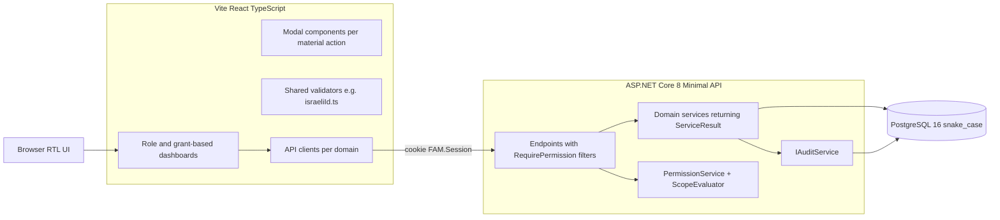
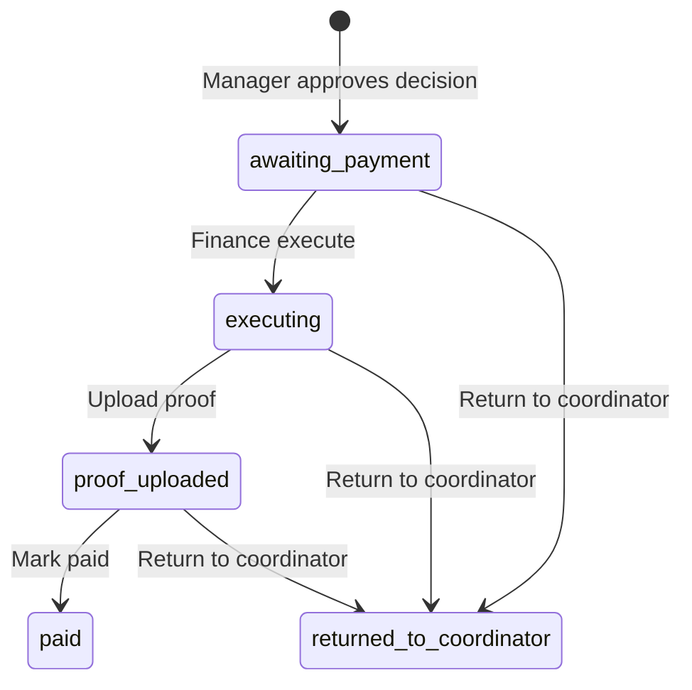
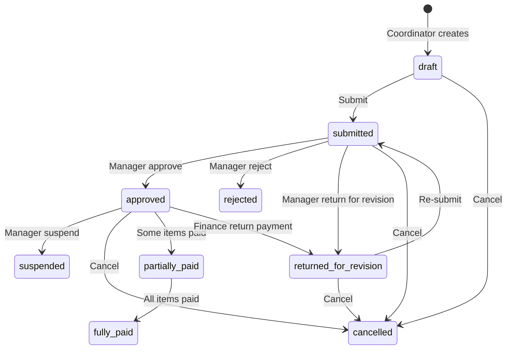
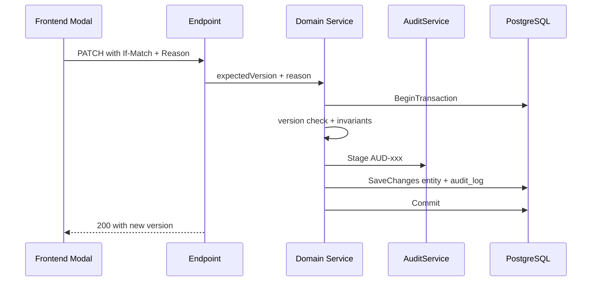

# Family Assistance Management — Canonical Architecture

**Document status:** Canonical living architecture document.
**Last updated baseline:** **Step 15 stabilized** (tag `step-15-stabilized`, commit `d5c3006`).
**Verification:** `scripts/verify-step15.ps1` passes **13/13**.
**Scope:** This document supersedes scattered per-step architecture notes for everything that is currently in scope. Per-step compliance reports under `docs/step-0N-*` remain as historical evidence.

---

## 1. System Overview

A multi-tenant, Hebrew RTL platform that lets non-profit organizations manage the full lifecycle of family assistance:

- Organization onboarding and SuperAdmin administration
- Internal user and role management with configurable grants
- Family registration (family card with embedded bank details)
- Assistance-type catalog
- Supplier registry
- Committee decisions with line-item assistance items
- Finance payment queue and execution

### Repository layout (essentials)

| Path | Purpose |
| ---- | ------- |
| `backend/FamilyAssistance.Api/` | Minimal API project |
| `backend/FamilyAssistance.Api/Migrations/` | EF Core migrations (applied on startup) |
| `frontend/src/` | React + TypeScript frontend |
| `docs/` | Architecture and compliance documents |
| `scripts/` | PowerShell end-to-end verification scripts |
| `.cursor/plans/` | Per-step technical design plans |
| `docker-compose.yml` | Local-dev environment (postgres + api + web) |

---

## 2. Technology Stack

| Layer | Technology |
| ----- | ---------- |
| Backend | ASP.NET Core 8 minimal API, C# 12 |
| Frontend | React 18 + TypeScript, Vite |
| Database | PostgreSQL 16 with EF Core 8 (`snake_case` mapping) |
| Auth | Server-side cookie session (`FAM.Session`), `PasswordHasher<User>` |
| Deploy | Docker Compose |
| Locale | Hebrew RTL across all screens |

### Cross-cutting building blocks

- **`ServiceResult<T>`** — uniform service return shape (`StatusCode`, `Code`, `Error`, `Details`, `Value`).
- **`ApiError`** — standardized error payload with Hebrew messages and machine-readable `code`.
- **`IAuditService`** — `Stage` / `LogAsync`; staged entries flush in the same `SaveChangesAsync` as the business change.
- **Optimistic concurrency** — mutating endpoints read `If-Match` header into an expected `version`; mismatch returns `409 VERSION_CONFLICT`.
- **Frontend conventions** — state-driven routing in `App.tsx`, dedicated modal per material action, Hebrew RTL throughout, no external UI component library.

---

## 3. Multi-Tenant Model

1. **Strict organization isolation.** Every business query is scoped by `organizationId` derived from the authenticated session (`AuthorizationContext.EffectiveOrganizationId`). Cross-organization access is impossible at endpoint, service, and DB-index layers.
2. **`organizationId` is never taken from the request body or query string** for authorization decisions.
3. **Composite unique indexes** enforce uniqueness within an organization (e.g. `(organization_id, family_code)`).
4. **Per-org atomic counters** on `organizations` generate system codes:
   - `family_code_counter` → `F-NNNNNN`
   - `supplier_code_counter` → `S-NNNNNN`
   - `decision_code_counter` → `D-NNNNNN`
5. **Suspended organizations** block login for all org users (`ORG_SUSPENDED` / `ACCOUNT_INACTIVE`).
6. **SuperAdmin** operates system-wide on `/api/v1/admin/*` and may **enter** an organization session (`actingOrganizationId`) with full bypass and audit (`AUD-025` / `AUD-026`).

---

## 4. Authentication and Sessions

| Concern | Implementation |
| ------- | -------------- |
| Session cookie | `FAM.Session` — opaque server-side token |
| Storage | `user_sessions` table; token hashed at rest |
| Revocation | On logout, user disable, and session expiry |
| Identity endpoint | `GET /api/v1/auth/me` returns user, role, grants, permissions, `fullAccess`, `actingOrganizationId` |
| Password hashing | `PasswordHasher<User>` |
| SuperAdmin seed | `SUPERADMIN_INITIAL_PASSWORD` environment variable |

**Security audit stream** (`security_audit_logs`, SEC-001..005): authentication and session events. Failure to write must fail the request (`500`).

Login endpoints:

| Endpoint | Method | Auth |
| -------- | :----: | ---- |
| `/api/v1/auth/login` | POST | none |
| `/api/v1/auth/logout` | POST | session |
| `/api/v1/auth/me` | GET | session |

---

## 5. Permissions System

Authorization is **grant + scope** based. Runtime code does **not** branch on legacy role name strings for protected endpoints.

### 5.1 Roles

| Role | Scope | Notes |
| ---- | ----- | ----- |
| `SuperAdmin` | System-wide | `/api/v1/admin/*`; may enter any org |
| `OrganizationAdministrator` | Single org | Unrestricted org access (`fullAccess`); not managed via grant matrix |
| `OrganizationUser` | Single org | Holds exactly one `organization_role_id` |
| Factory presets | Labels only | Seeded roles (`preset_coordinator`, `preset_manager`, `preset_finance`) are templates; OrgAdmin may change grants |

### 5.2 Permission catalog

37 system-defined keys in `PermissionKeys.cs`. Organizations cannot invent keys. Scopes: `my_records` | `organization` (`PermissionScopes.cs`).

| Category | Keys |
| -------- | ---- |
| Families | `families.view`, `.create`, `.edit`, `.deactivate`, `.restore`, `.export` |
| Suppliers | `suppliers.view`, `.create`, `.edit`, `.deactivate`, `.restore`, `.export` |
| Assistance types | `assistance_types.view`, `.create`, `.edit`, `.deactivate`, `.restore` |
| Committee decisions | `committee_decisions.view`, `.create`, `.edit_draft`, `.submit`, `.approve`, `.reject`, `.cancel` |
| Assistance items | `assistance_items.view`, `.create`, `.edit`, `.remove_draft` |
| Payments | `payments.view`, `.execute`, `.upload_proof`, `.mark_paid`, `.return_to_coordinator` |

**Catalog-only keys** (no API route at Step 15 baseline): `families.export`, `suppliers.export`, `assistance_types.restore`, `assistance_items.view`.

### 5.3 Authorization filters

| Filter | Behavior |
| ------ | -------- |
| `RequireAuthorization()` | Valid session required → `401 UNAUTHORIZED` |
| `RequireSuperAdmin()` | `Role == SuperAdmin` |
| `RequireOrgAdmin()` | OrgAdmin or SuperAdmin in org session |
| `RequireOrgContext()` | Builds `AuthorizationContext`; requires `EffectiveOrganizationId` |
| `RequirePermission(key)` | Org context + `PermissionService.HasGrantAsync` → `403 FORBIDDEN` |

**Scope evaluation** (`ScopeEvaluator.cs`): family and committee-decision list access respects `my_records` vs `organization` scope on the relevant view/edit grant.

### 5.4 OrgAdmin permission management APIs

| Endpoint | Method | Filter |
| -------- | :----: | ------ |
| `/api/v1/org/permissions/catalog` | GET | `RequireOrgAdmin` |
| `/api/v1/org/roles` | GET, POST | `RequireOrgAdmin` |
| `/api/v1/org/roles/{id}` | GET, PATCH | `RequireOrgAdmin` |
| `/api/v1/org/roles/{id}/disable` | PATCH | `RequireOrgAdmin` |
| `/api/v1/org/roles/{id}/restore` | PATCH | `RequireOrgAdmin` |
| `/api/v1/org/roles/{id}/grants` | PUT | `RequireOrgAdmin` |
| `/api/v1/org/roles/{id}/grants/reset` | POST | `RequireOrgAdmin` |

Frontend navigation (`OrgUserDashboard`, `OrgAdminDashboard`) shows tabs based on `hasPermission(user, key)`; backend remains source of truth.

### 5.5 User permission overrides (UPO)

Per-user grants and denials layer on top of role template defaults. **OrgAdmin** and **SuperAdmin** are outside this system (`fullAccess` bypass).

**Effective formula:** `effective = (roleTemplateGrants ⊕ userGrants) − userDenials` — deny wins; user grant replaces scope for the same key.

| Storage | `user_permission_overrides` — one row per `(user_id, permission_key)` with `effect` (`grant`|`deny`) and optional `scope` |
| Audit | `AUD-039` per changed key; **no reason** required |
| APIs | `GET/PUT/DELETE /api/v1/org/users/{id}/permission-overrides` (OrgAdmin) |
| `/auth/me` | `grants` = effective set; optional `roleGrants` and `overrides` for UI diff |

---

## 6. Families and Family Card

### 6.1 Family card model

Bank details are **embedded** on the `families` row. There is no separate `bank_accounts` table.

| Field group | Fields |
| ----------- | ------ |
| Identity | `family_code` (system `F-NNNNNN`), `family_last_name`, parent names, Israeli IDs |
| Accounting | `accounting_code` (user-editable `long`), `accounting_coordinator_id` (immutable after create) |
| Contact | `phone`, `address` |
| Assignment | `assigned_coordinator_id` |
| Bank (embedded) | `bank_number`, `branch_number`, `account_number`, `account_holder_name` |
| Status | `active` / `inactive`; `version` for concurrency |

### 6.2 Family APIs

| Endpoint | Method | Permission |
| -------- | :----: | ---------- |
| `/api/v1/org/families` | GET | `families.view` |
| `/api/v1/org/families/suggested-accounting-code` | GET | `families.create` |
| `/api/v1/org/families` | POST | `families.create` |
| `/api/v1/org/families/{id}` | GET | `families.view` |
| `/api/v1/org/families/{id}` | PATCH | `families.edit` |
| `/api/v1/org/families/{id}/deactivate` | PATCH | `families.deactivate` |
| `/api/v1/org/families/{id}/restore` | PATCH | `families.restore` |

### 6.3 Family validation rules

- **Israeli ID** — optional; if provided, 9 digits + Luhn-style checksum (`IsraeliIdValidator.cs` / `frontend/src/validation/israeliId.ts`).
- **Bank on card save** (`BankFieldValidator.ValidateForSave`) — all four fields empty **or** all four complete and valid; partial state rejected (`400`).
- **Family code** — system-generated only; never accepted from client.
- **Scope** — coordinators with `my_records` scope see/edit only families they are assigned to.

---

## 7. Assistance Types

Org-scoped catalog of assistance categories. Currency fixed to **ILS** on create.

| Endpoint | Method | Permission |
| -------- | :----: | ---------- |
| `/api/v1/org/assistance-types` | GET | `assistance_types.view` |
| `/api/v1/org/assistance-types` | POST | `assistance_types.create` |
| `/api/v1/org/assistance-types/{id}` | GET | `assistance_types.view` |
| `/api/v1/org/assistance-types/{id}` | PATCH | `assistance_types.edit` |
| `/api/v1/org/assistance-types/{id}/deactivate` | PATCH | `assistance_types.deactivate` |

- **Type code** — uppercase A–Z, 0–9, hyphen; length 2–50; unique within org.
- **Deactivation** — one-way in current scope (no restore endpoint).

---

## 8. Suppliers

Supplier card mirrors family bank embedding: bank fields live on `suppliers` row.

| Field | Notes |
| ----- | ----- |
| `supplier_code` | System-generated `S-NNNNNN` |
| `name`, `registration_number`, `phone`, `address` | Identity / contact |
| Bank fields | Same all-or-nothing save rules as families |
| `status` | `active` / `inactive` |

| Endpoint | Method | Permission |
| -------- | :----: | ---------- |
| `/api/v1/org/suppliers` | GET | `suppliers.view` |
| `/api/v1/org/suppliers` | POST | `suppliers.create` |
| `/api/v1/org/suppliers/{id}` | GET | `suppliers.view` |
| `/api/v1/org/suppliers/{id}` | PATCH | `suppliers.edit` |
| `/api/v1/org/suppliers/{id}/deactivate` | PATCH | `suppliers.deactivate` |
| `/api/v1/org/suppliers/{id}/restore` | PATCH | `suppliers.restore` |

---

## 9. Committee Decisions

A committee decision is an org-scoped header tied to one **family**, with a meeting date, summary, status, and a collection of assistance items.

| Field | Notes |
| ----- | ----- |
| `decision_code` | System-generated `D-NNNNNN` |
| `family_id` | Required; family must be `active` |
| `meeting_date`, `summary` | Header fields editable in draft |
| `status` | See §13 Approval Workflow |
| `total_amount` | Sum of item amounts; maintained by service |
| `version` | Optimistic concurrency on header and item mutations |

### Committee decision APIs

| Endpoint | Method | Permission |
| -------- | :----: | ---------- |
| `/api/v1/org/committee-decisions` | GET | `committee_decisions.view` |
| `/api/v1/org/committee-decisions` | POST | `committee_decisions.create` |
| `/api/v1/org/committee-decisions/{id}` | GET | `committee_decisions.view` |
| `/api/v1/org/committee-decisions/{id}` | PATCH | `committee_decisions.edit_draft` |
| `/api/v1/org/committee-decisions/{id}/submit` | POST | `committee_decisions.submit` |
| `/api/v1/org/committee-decisions/{id}/approve` | POST | `committee_decisions.approve` |
| `/api/v1/org/committee-decisions/{id}/reject` | POST | `committee_decisions.reject` |
| `/api/v1/org/committee-decisions/{id}/suspend` | POST | `committee_decisions.approve` |
| `/api/v1/org/committee-decisions/{id}/cancel` | POST | `committee_decisions.cancel` |

Header and items are editable only when status ∈ `{ draft, returned_for_revision }`.

---

## 10. Assistance Items

Line items belong to a committee decision. Max **20 items** per decision.

| Field | Notes |
| ----- | ----- |
| `line_number` | 1-based; assigned sequentially by backend |
| `assistance_type_id` | Must reference active type in org |
| `description`, `amount` | Amount > 0, ≤ 1,000,000 |
| `payment_target` | `family` \| `supplier` \| `other` |
| `payment_method` | `bank_transfer` \| `check` \| `vouchers` |
| `supplier_id` | Required when target = `supplier` |
| `payee_name` | Required when target = `other` |
| `voucher_type` | Required when method = `vouchers` |
| `is_urgent` | Per-item flag (not on decision header) |
| `execution_status` | Tracks payment lifecycle on item |

### Assistance item APIs

| Endpoint | Method | Permission |
| -------- | :----: | ---------- |
| `/api/v1/org/committee-decisions/{id}/items` | POST | `assistance_items.create` |
| `/api/v1/org/committee-decisions/{decisionId}/items/{itemId}` | PATCH | `assistance_items.edit` |
| `/api/v1/org/committee-decisions/{decisionId}/items/{itemId}` | DELETE | `assistance_items.remove_draft` |

**Payment target and payment method are independent fields** — validations never infer one from the other.

---

## 11. Payment Queue

On manager **approve**, one `payment_executions` row is created per assistance item at status `awaiting_payment`.

### Payment execution statuses

| Status | Meaning |
| ------ | ------- |
| `awaiting_payment` | In queue; default on create |
| `executing` | Finance started execution |
| `proof_uploaded` | Proof document attached |
| `paid` | Marked paid |
| `returned_to_coordinator` | Sent back to coordinator |

Queue list (`GET /payments`) includes `awaiting_payment`, `executing`, `proof_uploaded`.

### Payment APIs

| Endpoint | Method | Permission |
| -------- | :----: | ---------- |
| `/api/v1/org/payments` | GET | `payments.view` |
| `/api/v1/org/payments/{id}` | GET | `payments.view` |
| `/api/v1/org/payments/{id}/execute` | POST | `payments.execute` |
| `/api/v1/org/payments/{id}/proof` | POST | `payments.upload_proof` |
| `/api/v1/org/payments/{id}/mark-paid` | PATCH | `payments.mark_paid` |
| `/api/v1/org/payments/{id}/return-to-coordinator` | POST | `payments.return_to_coordinator` |

### Payment lifecycle

When all items on a decision are `paid`, decision status becomes `fully_paid`; partial completion → `partially_paid`. Return-to-coordinator sets decision to `returned_for_revision`.

---

## 12. Bank-Transfer Eligibility Rules

**Architectural rule:** Bank transfer (`payment_method = bank_transfer`) to a **family** or **supplier** target is allowed only when that payee record has **complete, valid bank details**. This is enforced in the **backend**, not only in the UI.

### Card save (families and suppliers)

`BankFieldValidator.ValidateForSave`:

| State | Result |
| ----- | ------ |
| All four bank fields empty | Allow save |
| All four complete + valid (known Israeli bank code, digits-only branch/account, holder name) | Allow save |
| Partial (some filled, some empty) | `400` validation error |
| Complete but invalid format / unknown bank | `400` validation error |

`BankVerifiedExternally` does **not** exist. Bank name is derived from the Israeli bank registry at read time; not persisted.

### Assistance item add/update

`CommitteeDecisionService.ValidateBankTransferBankDetails` uses `BankFieldValidator.ValidateCompleteForPayment`:

| Condition | Payee checked |
| --------- | ------------- |
| `payment_target = family` AND `payment_method = bank_transfer` | Decision's family embedded bank |
| `payment_target = supplier` AND `payment_method = bank_transfer` | Selected supplier embedded bank |
| `payment_target = other` | No bank check (manual payee) |
| `payment_method` ∈ `{ check, vouchers }` | No bank check |

Failure → **`400 INCOMPLETE_BANK_DETAILS`**.

### Payment execute (defense in depth)

`PaymentService.ExecuteAsync` repeats the same `ValidateCompleteForPayment` check before transitioning to `executing`. A item that somehow reached the queue without complete bank details is blocked here as well.

---

## 13. Approval Workflow

### Committee decision statuses

`draft` · `submitted` · `returned_for_revision` · `approved` · `rejected` · `suspended` · `cancelled` · `partially_paid` · `fully_paid`

### Status transitions

| Action | From | To | Permission | Notes |
| ------ | ---- | -- | ---------- | ----- |
| Create | — | `draft` | `committee_decisions.create` | |
| Edit header / items | `draft`, `returned_for_revision` | same | `edit_draft`, item grants | |
| Submit | `draft`, `returned_for_revision` | `submitted` | `committee_decisions.submit` | Requires ≥1 item; no reason required |
| Approve | `submitted` | `approved` | `committee_decisions.approve` | Creates payment queue entries |
| Reject | `submitted` | `rejected` | `committee_decisions.reject` | Reason required (3–500 chars) |
| Return for revision | `submitted` | `returned_for_revision` | `committee_decisions.reject` | `returnForRevision=true`; reason required |
| Suspend | `approved`, `partially_paid` | `suspended` | `committee_decisions.approve` | Reason required |
| Cancel | `draft`, `submitted`, `returned_for_revision`, `approved` | `cancelled` | `committee_decisions.cancel` | Reason required |

---

## 14. Audit Requirements

### Two audit streams

| Stream | Table | Code prefix | When written |
| ------ | ----- | ----------- | ------------ |
| Security | `security_audit_logs` | SEC-xxx | Auth events; failure → `500` |
| Business | `audit_logs` | AUD-xxx | Domain mutations; same transaction as business change |

### Material actions

Actions that change status or perform irreversible business impact require a **`Reason`** of length 3–500, enforced centrally in `AuditService.CreateLog`. Missing reason throws `ArgumentException` and rolls back the transaction.

Examples at Step 15 baseline: `organization_suspend`, `user_disable`, `family_deactivate`, `family_restore`, `assistance_type_deactivate`, `supplier_deactivate`, `supplier_restore`, committee `reject` / `suspend` / `cancel`, payment `return_to_coordinator`.

Non-material mutations (e.g. committee submit, assistance item create) do not require a reason.

### Business event codes (AUD-001..038)

| Code | Event |
| ---- | ----- |
| AUD-001 | Organization create |
| AUD-002 | Organization suspend |
| AUD-003 | OrgAdmin bootstrap |
| AUD-004..006 | Org user create / update / disable |
| AUD-007..009 | Family create / update / deactivate |
| AUD-010..012 | Assistance type create / update / deactivate |
| AUD-013..015 | Supplier create / update / identity change |
| AUD-016 | Role grants update |
| AUD-017..020 | Organization restore, user restore, role change, password reset |
| AUD-021..024 | Role create / update / disable / restore |
| AUD-025..026 | SuperAdmin enter / exit org |
| AUD-027..028 | Family bank change / restore |
| AUD-029..032 | Payment execute / proof / mark paid / return |
| AUD-033..034 | Committee decision create / status change |
| AUD-035..036 | Assistance item create / update |
| AUD-037..038 | Supplier deactivate / restore |

### Concurrency flow (material PATCH)

---

## 15. Database Tables

All editable business entities use `version int` for optimistic concurrency. All tables use `snake_case` columns via `AppDbContext.ApplySnakeCaseNames`.

| Table | Versioned | Purpose |
| ----- | :-------: | ------- |
| `organizations` | Yes | Tenant root; code + status + per-org counters |
| `users` | Yes | Org users and SuperAdmin |
| `user_sessions` | No | Server-side session tokens |
| `audit_logs` | No | Business audit (append-only) |
| `security_audit_logs` | No | Security audit (append-only) |
| `families` | Yes | Family card with embedded bank |
| `suppliers` | Yes | Supplier card with embedded bank |
| `assistance_types` | Yes | Assistance type catalog |
| `committee_decisions` | Yes | Committee decision headers |
| `assistance_items` | Yes | Line items per decision |
| `assistance_item_documents` | Yes | Payment proof documents |
| `payment_executions` | Yes | Finance payment queue rows |
| `permission_catalog` | No | System permission key definitions |
| `organization_roles` | Yes | Configurable org roles |
| `organization_role_grants` | No | Permission + scope per role |
| `organization_role_permissions` | No | Legacy role-permission rows (migration artifact) |

**Retired design:** `bank_accounts`, `bank_account_history` — never implemented; bank is embedded on `families` and `suppliers`.

---

## 16. Verification Scripts

Every stabilized baseline ships with PowerShell scripts that exercise end-to-end flows via `curl.exe` against `http://localhost:8080`. Scripts must pass before a release tag is created.

| Script | Scope |
| ------ | ----- |
| `scripts/verify-step01.ps1` | Step 1 — foundation, auth, sessions |
| `scripts/verify-step02.ps1` | Step 2 — SuperAdmin org management |
| `scripts/verify-step03.ps1` | Step 3 — OrgAdmin users, activity log |
| `scripts/verify-step04.ps1` | Step 4 — families, assistance types |
| `scripts/verify-step04_1.ps1` | Step 4.1 — family card extensions |
| `scripts/verify-family-card.ps1` | Family card (§14) |
| `scripts/verify-supplier-card.ps1` | Supplier card |
| `scripts/verify-permissions-system.ps1` | Permissions + scope system |
| **`scripts/verify-step15.ps1`** | **Step 15 — committee decisions, suppliers, payments (13/13)** |

### Step 15 verification coverage (S15-01..S15-13)

- Supplier create with bank; manager list
- Committee decision draft + item add (`bank_transfer`, per-item `isUrgent`)
- Supplier target without supplier rejected
- Submit → approve → payment queue → execute with complete bank
- **Add `bank_transfer` item to family without bank → `400 INCOMPLETE_BANK_DETAILS`**
- Coordinator without `payments.view` → `403`
- Schema presence: `suppliers`, `committee_decisions` tables

---

## 17. Approved Development Phases

### Steps 1–4 (approved)

| Step | Title | Primary actor(s) | Scope summary | Audit codes | Git tag |
| ---- | ----- | ---------------- | ------------- | ----------- | ------- |
| 1 | Foundation | SuperAdmin (seeded) | Auth, server-side sessions, security audit, core schema | SEC-001..005 | — (initial commit) |
| 2 | SuperAdmin organization management | SuperAdmin | Create org, suspend org with reason, bootstrap first OrgAdmin | AUD-001..003 | `step-2-approved` |
| 3 | OrgAdmin user management + Activity Log | OrganizationAdministrator | Create / edit / disable users; read-only Activity Log | AUD-004..006 | `step-3-approved` |
| 4 | Families + Assistance Types | Coordinator, Finance, Manager, OrgAdmin | `F-NNNNNN`, Israeli ID checksum, ILS currency, type codes | AUD-007..012 | `step-4-approved` |

### Intermediate phases (implemented, verified by dedicated scripts)

| Phase | Scope | Verification |
| ----- | ----- | ------------ |
| Permissions + scope | Grant-based authorization, org roles, SuperAdmin enter-org | `verify-permissions-system.ps1` |
| Family card (§14) | Embedded bank, accounting code, restore | `verify-family-card.ps1`, `verify-step04_1.ps1` |
| Supplier card | Embedded bank, `S-NNNNNN`, restore | `verify-supplier-card.ps1` |

### Step 15 — **STABILIZED**

| Item | Detail |
| ---- | ------ |
| **Tag** | `step-15-stabilized` |
| **Commit** | `d5c3006` |
| **Scope** | Committee decisions, assistance items (per-item urgency), suppliers integration, finance payment queue, backend bank-transfer eligibility on item add/update and payment execute |
| **Verification** | `verify-step15.ps1` — **13/13 PASS** |

### Binding architectural decisions (Steps 1–15)

1. Multi-tenant strict isolation (§3).
2. Server-side sessions — no JWT (§4).
3. Grant + scope authorization; no runtime role-name branching (§5).
4. EF Core + PostgreSQL, `snake_case`; migrations on startup (§2).
5. Material actions require `Reason` 3–500 chars (§14).
6. Optimistic concurrency via `If-Match` on every mutating PATCH/DELETE (§2).
7. System-generated codes: org code, `F-NNNNNN`, `S-NNNNNN`, `D-NNNNNN`, assistance type code (§3, §6–§9).
8. ILS only for assistance types (§7).
9. One-way deactivation for assistance types; restore supported for orgs, users, roles, families, suppliers (§6–§8).
10. Orphan prevention — coordinator with active families cannot be disabled (`409 COORDINATOR_HAS_ACTIVE_FAMILIES`).
11. Last-OrgAdmin protection (`409 LAST_ORG_ADMIN`).
12. Hebrew RTL UI throughout (§2).
13. Two separate audit streams (§14).
14. No physical deletes of business entities — status flips only.
15. Standardized `ApiError` model (§2).
16. No external UI component library (§2).
17. **Bank transfer requires complete payee bank details — enforced in backend** (§12).
18. Automated PowerShell verification before release tags (§16).
